# Lightning Lesson 1: Flows vs Crews Demo

## Overview

This demo demonstrates the strategic decision-making framework between CrewAI Flows and Crews through a live, side-by-side comparison. The goal is to show **when structure beats autonomy** in enterprise AI applications.

## Three Approaches Demonstrated

### 1. Crew-Only (Autonomous)
- **Philosophy**: Maximum autonomy, minimal structure
- **Use Case**: Creative tasks where unpredictability is acceptable
- **Characteristics**: High creativity, variable output, difficult to control

### 2. Flow-Only (Structured)  
- **Philosophy**: Precise control with direct LLM orchestration
- **Use Case**: Compliance workflows requiring predictable execution
- **Characteristics**: Deterministic, auditable, limited collaboration

### 3. Hybrid (Orchestrated + Collaborative)
- **Philosophy**: Structure where needed, intelligence where valuable
- **Use Case**: Enterprise systems requiring both control and creativity
- **Characteristics**: Optimal balance, scalable, maintainable

**Resources**:
- Slides: [CrewAI Lightning Lesson Series LL1](https://maven.com/p/8f14d5/crew-ai-lightning-lesson-series-ll1)
- Recording:[Flows vs. Crews Live Session](https://maven.com/p/26eee4/flows-vs-crews-when-structure-beats-autonomy?utm_medium=github_link)

---

## Architecture & Flow Diagrams

The following diagrams illustrate how users interact with each approach and how LLMs are invoked. Each solution is shown separately for clarity:

### 1. Crew-Only (Autonomous) Architecture

```mermaid
graph TB
    %% User Interaction
    User[👤 User] --> CLI[`run_demo.py`<br/>Command Line Interface]
    CLI --> DemoRunner[`LightningLesson1Demo`<br/>Orchestration Engine]
    
    %% Crew-Only Path
    DemoRunner --> CrewDemo[`CrewOnlyDemo`]
    CrewDemo --> CrewAgents[`CrewAI Agents`<br/>Writer + Reviewer]
    
    %% Agent Collaboration
    CrewAgents --> Writer[`🤖 Writer Agent`]
    CrewAgents --> Reviewer[`🤖 Reviewer Agent`]
    
    %% LLM Calls
    Writer --> WriterLLM[`🧠 LLM Call`<br/>Content Generation]
    Reviewer --> ReviewerLLM[`🧠 LLM Call`<br/>Content Review]
    
    %% Output
    WriterLLM --> CrewOutput[`artifacts/crew_only_output.md`]
    ReviewerLLM --> CrewOutput
    
    %% Styling
    classDef userClass fill:#e1f5fe,stroke:#01579b,stroke-width:2px,color:#000
    classDef crewClass fill:#f3e5f5,stroke:#4a148c,stroke-width:2px,color:#000
    classDef llmClass fill:#ffebee,stroke:#c62828,stroke-width:2px,color:#000
    classDef outputClass fill:#f1f8e9,stroke:#33691e,stroke-width:2px,color:#000
    
    class User,CLI,DemoRunner userClass
    class CrewDemo,CrewAgents,Writer,Reviewer crewClass
    class WriterLLM,ReviewerLLM llmClass
    class CrewOutput outputClass
```



**Key Characteristics:**
- **High Autonomy**: Agents work independently with minimal control
- **Collaborative**: Writer and Reviewer agents work together
- **Unpredictable**: Output varies based on agent interactions
- **Creative**: Maximum freedom for innovative solutions

### 2. Flow-Only (Structured) Architecture

```mermaid
graph TB
    %% User Interaction
    User[👤 User] --> CLI[`run_demo.py`<br/>Command Line Interface]
    CLI --> DemoRunner[`LightningLesson1Demo`<br/>Orchestration Engine]
    
    %% Flow-Only Path
    DemoRunner --> FlowDemo[`FlowOnlyDemo`]
    FlowDemo --> FlowOrchestrator[`Flow Orchestrator`]
    
    %% Sequential Steps
    FlowOrchestrator --> Step1[`1. Initialize Topic`]
    Step1 --> Step2[`2. Create Outline`]
    Step2 --> Step3[`3. Draft Content`]
    Step3 --> Step4[`4. Compliance Review`]
    Step4 --> Step5[`5. Finalize Content`]
    
    %% LLM Calls for Each Step
    Step1 --> LLM1[`🧠 LLM Call`<br/>Topic Initialization]
    Step2 --> LLM2[`🧠 LLM Call`<br/>Outline Generation]
    Step3 --> LLM3[`🧠 LLM Call`<br/>Content Drafting]
    Step4 --> LLM4[`🧠 LLM Call`<br/>Compliance Review]
    Step5 --> LLM5[`🧠 LLM Call`<br/>Content Finalization]
    
    %% Output
    LLM1 --> FlowOutput[`artifacts/flow_only_output.md`]
    LLM2 --> FlowOutput
    LLM3 --> FlowOutput
    LLM4 --> FlowOutput
    LLM5 --> FlowOutput
    
    %% Styling
    classDef userClass fill:#e1f5fe,stroke:#01579b,stroke-width:2px,color:#000
    classDef flowClass fill:#e8f5e8,stroke:#1b5e20,stroke-width:2px,color:#000
    classDef llmClass fill:#ffebee,stroke:#c62828,stroke-width:2px,color:#000
    classDef outputClass fill:#f1f8e9,stroke:#33691e,stroke-width:2px,color:#000
    
    class User,CLI,DemoRunner userClass
    class FlowDemo,FlowOrchestrator,Step1,Step2,Step3,Step4,Step5 flowClass
    class LLM1,LLM2,LLM3,LLM4,LLM5 llmClass
    class FlowOutput outputClass
```



**Key Characteristics:**
- **High Control**: Step-by-step execution with precise control
- **Predictable**: Deterministic flow with consistent outputs
- **Auditable**: Each step is clearly defined and traceable
- **Efficient**: Direct LLM calls without agent overhead

### 3. Hybrid (Orchestrated + Collaborative) Architecture


**Key Characteristics:**
- **Balanced Control**: Structure where needed, autonomy where valuable
- **Selective Collaboration**: Mini crews for complex tasks, direct calls for simple ones
- **Scalable**: Can handle both simple and complex workflows
- **Maintainable**: Clear separation of concerns with flexible orchestration

### Key Architectural Differences

| Aspect | Crew-Only | Flow-Only | Hybrid |
|--------|-----------|-----------|--------|
| **Control** | Agent autonomy | Step-by-step control | Orchestrated with collaboration |
| **LLM Calls** | Agent-driven | Direct function calls | Mixed approach |
| **Predictability** | Low | High | Medium-High |
| **Creativity** | High | Low | Medium-High |
| **Auditability** | Low | High | High |
| **Scalability** | Limited | High | High |

## Quick Start

### Prerequisites

```bash
pip install -r requirements.txt
```

### Environment Setup

1. Copy the environment template:
```bash
cp env.example .env
```

2. Add your OpenAI API key to `.env`:
```
OPENAI_API_KEY=your_api_key_here
```

### Running the Demo

#### Option 1: Run All Approaches (Recommended)
```bash
python run_demo.py
```

#### Option 2: Run Specific Approach
```bash
# Run only crew-only approach
python run_demo.py --approach crew

# Run only flow-only approach  
python run_demo.py --approach flow

# Run only hybrid approach
python run_demo.py --approach hybrid

# Custom topic and audience
python run_demo.py --topic "Database Security" --audience "DevOps Engineers"
```

#### Option 3: Run Individual Approaches Programmatically
```python
import sys
from pathlib import Path

# Add src directory to path
sys.path.insert(0, str(Path(__file__).parent / "src"))

from crew_only import CrewOnlyDemo
from flow_only import FlowOnlyDemo  
from hybrid_flow import HybridFlowDemo

# Crew-only approach
crew_demo = CrewOnlyDemo("API Security", "Developers")
crew_result = crew_demo.run_demo()

# Flow-only approach
flow_demo = FlowOnlyDemo("API Security", "Developers")
flow_result = flow_demo.kickoff()

# Hybrid approach
hybrid_demo = HybridFlowDemo("API Security", "Developers")
hybrid_result = hybrid_demo.kickoff()
```

## Demo Structure

### Stage A: Crew-Only Baseline (2 minutes)
- Creates autonomous agents with minimal constraints
- Executes composite task showing potential chaos
- Highlights unpredictability and control challenges

### Stage B: Flow-Only Structure (3 minutes)
- Uses `@start()`, `@listen()`, `@router()` decorators
- Demonstrates precise state management
- Shows predictable execution path

### Stage C: Hybrid Architecture (4 minutes)
- Combines Flow orchestration with targeted Crew collaboration
- Uses mini crew for complex reasoning tasks
- Demonstrates optimal balance of structure and intelligence

## Key Learning Outcomes

⚡ **Master Flow Architecture Patterns** - Implement structured workflows with precise control

⚡ **Design Hybrid Systems** - Architect systems where Flows orchestrate and Crews collaborate

⚡ **Apply Strategic Decision Framework** - Choose the right approach based on business requirements

## Architecture Benefits

| Approach | Control | Creativity | Predictability | Audit Trail | Enterprise Ready |
|----------|---------|------------|----------------|-------------|------------------|
| Crew-Only | Low | High | Low | Poor | No |
| Flow-Only | High | Low | High | Excellent | Yes |
| Hybrid | High | High | High | Excellent | Yes |

## Decision Framework

### Use Crew-Only When:
- Maximum creativity is required
- Unpredictability is acceptable
- Rapid prototyping is needed
- Resource constraints are minimal

### Use Flow-Only When:
- Compliance requirements are strict
- Predictable execution is critical
- Audit trails are mandatory
- Cost control is important

### Use Hybrid When:
- Both structure and creativity are needed
- Enterprise deployment is planned
- Scalability is required
- Maintenance is a concern

## Performance Monitoring

The demo includes comprehensive performance tracking:

- **Execution Time**: Per-stage timing analysis
- **Success Rates**: Error tracking and recovery
- **Resource Usage**: Token consumption monitoring
- **Quality Metrics**: Output consistency measurement

## File Structure

```
LL1/
├── src/                    # Source code directory
│   ├── __init__.py         # Package initialization
│   ├── state.py            # Shared state models
│   ├── crew_only.py        # Crew-only implementation
│   ├── flow_only.py        # Flow-only implementation
│   ├── hybrid_flow.py      # Hybrid implementation
│   ├── mini_crew.py        # Mini crew for hybrid approach
│   └── demo_runner.py      # Main demo orchestrator
├── docs/                   # Documentation directory
│   ├── demo-strategy.md    # Detailed strategy document
│   ├── backend.md          # Backend implementation document
│   └── test-strategy.md    # Comprehensive testing strategy
├── test/                   # Test suite directory
│   ├── unit/               # Unit tests
│   │   ├── test_agents.py  # Agent functionality tests
│   │   ├── test_flows.py   # Flow implementation tests
│   │   ├── test_state.py   # State model tests
│   │   └── test_utils.py   # Utility function tests
│   ├── integration/        # Integration tests
│   ├── e2e/               # End-to-end tests
│   ├── performance/        # Performance tests
│   └── test-results.md     # Test execution log and status
├── artifacts/              # Generated output files
│   ├── README.md           # Artifacts documentation
│   ├── crew_only_output.md # Crew-only demo output
│   ├── flow_only_output.md # Flow-only demo output
│   ├── hybrid_flow_output.md # Hybrid demo output
│   └── ll1_demo_results_*.json # Complete demo results
├── run_demo.py             # Command-line demo runner
├── requirements.txt        # Dependencies
├── env.example             # Environment template
└── README.md               # This file
```

## Customization

### Changing the Topic
Use command line arguments or modify the demo runner:

```bash
python run_demo.py --topic "Your Custom Topic" --audience "Your Target Audience"
```

Or programmatically:
```python
from src.demo_runner import LightningLesson1Demo

demo = LightningLesson1Demo(
    topic="Your Custom Topic",
    audience="Your Target Audience"
)
```

### Adding New Agents
Extend the mini crew in `src/mini_crew.py`:

```python
def run_writer_reviewer_crew(topic, outline, audience):
    # Add your custom agents here
    custom_agent = Agent(
        role="Your Role",
        goal="Your Goal",
        backstory="Your Backstory"
    )
    # ... rest of implementation
```

### Modifying Flow Logic
Update the flow decorators in `src/hybrid_flow.py`:

```python
@listen(your_previous_step)
def your_custom_step(self, state):
    # Your custom logic here
    return self.state
```

## Troubleshooting

### Common Issues

1. **API Key Not Set**
   - Ensure `OPENAI_API_KEY` is set in `.env`
   - Verify the key has sufficient credits

2. **Import Errors**
   - Install dependencies: `pip install -r requirements.txt`
   - Check Python version compatibility

3. **Timeout Issues**
   - Increase timeout values in LLM calls
   - Check network connectivity

4. **Memory Issues**
   - Reduce batch sizes
   - Clear state between runs

### Debug Mode

Enable verbose logging:

```python
import logging
logging.basicConfig(level=logging.DEBUG)
```

## Contributing

1. Fork the repository
2. Create a feature branch
3. Make your changes
4. Add tests if applicable
5. Submit a pull request

## License

This demo is part of the CrewAI Lightning Lesson Series. See the main project for licensing information.

## Support

For questions or issues:
- Check the troubleshooting section above
- Review the demo strategy document
- Open an issue in the main repository
