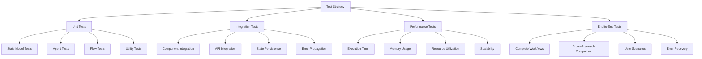

# Lightning Lesson 1 Test Strategy

## Executive Summary

This test strategy document outlines the comprehensive testing approach for the Lightning Lesson 1 demo: "Flows vs Crews: When Structure Beats Autonomy". The strategy covers unit testing, integration testing, performance testing, and end-to-end validation for all three architectural approaches (Crew-Only, Flow-Only, and Hybrid).

## Test Objectives

### Primary Goals
- **Functional Validation**: Ensure all three approaches produce expected outputs
- **Performance Benchmarking**: Validate performance characteristics and resource usage
- **Reliability Testing**: Verify error handling and recovery mechanisms
- **Quality Assurance**: Confirm output consistency and compliance requirements

### Success Criteria
- **Test Coverage**: ≥90% code coverage across all modules
- **Performance**: Hybrid approach 20-30% faster than Crew-Only
- **Reliability**: <1% failure rate across all test scenarios
- **Consistency**: <5% output variance for deterministic approaches

## Test Architecture Overview

### Test Categories



## Detailed Test Specifications

### 1. Unit Tests

#### 1.1 State Model Tests (`test_state.py`)

**Objective**: Validate Pydantic models and data validation

**Test Cases**:
```python
def test_lesson1_state_initialization():
    """Test state initialization with valid inputs"""
    
def test_lesson1_state_validation():
    """Test state validation with invalid inputs"""
    
def test_guide_outline_serialization():
    """Test GuideOutline model serialization"""
    
def test_review_result_validation():
    """Test ReviewResult model validation"""
    
def test_performance_metrics_tracking():
    """Test performance metrics collection"""
    
def test_error_logging():
    """Test error logging functionality"""
```

**Coverage Requirements**:
- All Pydantic model fields
- Validation rules and constraints
- Serialization/deserialization
- Error handling for invalid data

#### 1.2 Agent Tests (`test_agents.py`)

**Objective**: Validate agent creation and configuration

**Test Cases**:
```python
def test_crew_only_agent_creation():
    """Test Crew-Only agent initialization"""
    
def test_flow_only_llm_configuration():
    """Test Flow-Only LLM configuration"""
    
def test_hybrid_agent_creation():
    """Test Hybrid approach agent creation"""
    
def test_mini_crew_agent_setup():
    """Test mini crew agent configuration"""
    
def test_agent_backstory_validation():
    """Test agent backstory and goal validation"""
```

**Coverage Requirements**:
- Agent role and goal validation
- Backstory configuration
- Tool assignment and configuration
- Memory setup and management

#### 1.3 Flow Tests (`test_flows.py`)

**Objective**: Validate Flow decorators and state transitions

**Test Cases**:
```python
def test_flow_start_decorator():
    """Test @start() decorator functionality"""
    
def test_flow_listen_decorator():
    """Test @listen() decorator functionality"""
    
def test_flow_router_decorator():
    """Test @router() decorator functionality"""
    
def test_state_transition_validation():
    """Test state transition validation"""
    
def test_flow_error_handling():
    """Test Flow error handling and recovery"""
```

**Coverage Requirements**:
- All Flow decorators
- State transition logic
- Error handling mechanisms
- Conditional routing

#### 1.4 Utility Tests (`test_utils.py`)

**Objective**: Validate utility functions and helper classes

**Test Cases**:
```python
def test_performance_tracker():
    """Test PerformanceTracker class"""
    
def test_demo_runner_initialization():
    """Test DemoRunner initialization"""
    
def test_result_serialization():
    """Test result serialization to JSON"""
    
def test_error_recovery_utilities():
    """Test error recovery utility functions"""
```

### 2. Integration Tests

#### 2.1 Component Integration Tests (`test_integration.py`)

**Objective**: Validate component interactions and data flow

**Test Cases**:
```python
def test_crew_only_integration():
    """Test Crew-Only end-to-end integration"""
    
def test_flow_only_integration():
    """Test Flow-Only end-to-end integration"""
    
def test_hybrid_integration():
    """Test Hybrid approach integration"""
    
def test_state_persistence_across_components():
    """Test state persistence across components"""
    
def test_error_propagation():
    """Test error propagation between components"""
```

**Coverage Requirements**:
- Component communication
- Data flow validation
- State consistency
- Error propagation

#### 2.2 API Integration Tests (`test_api.py`)

**Objective**: Validate external API interactions

**Test Cases**:
```python
def test_openai_api_integration():
    """Test OpenAI API integration"""
    
def test_llm_response_handling():
    """Test LLM response handling"""
    
def test_api_error_handling():
    """Test API error handling and retries"""
    
def test_rate_limiting():
    """Test rate limiting and throttling"""
```

**Coverage Requirements**:
- API connectivity
- Response parsing
- Error handling
- Rate limiting

### 3. Performance Tests

#### 3.1 Execution Time Tests (`test_performance.py`)

**Objective**: Validate performance characteristics and benchmarks

**Test Cases**:
```python
def test_crew_only_execution_time():
    """Test Crew-Only execution time benchmarks"""
    
def test_flow_only_execution_time():
    """Test Flow-Only execution time benchmarks"""
    
def test_hybrid_execution_time():
    """Test Hybrid execution time benchmarks"""
    
def test_performance_comparison():
    """Test performance comparison between approaches"""
    
def test_memory_usage():
    """Test memory usage across approaches"""
```

**Performance Benchmarks**:
- **Crew-Only**: 45-60 seconds (±20s variance)
- **Flow-Only**: 15-25 seconds (±3s variance)
- **Hybrid**: 25-35 seconds (±5s variance)
- **Memory Usage**: <10MB per demo instance

#### 3.2 Scalability Tests (`test_scalability.py`)

**Objective**: Validate system scalability and resource usage

**Test Cases**:
```python
def test_concurrent_execution():
    """Test concurrent demo execution"""
    
def test_resource_utilization():
    """Test resource utilization under load"""
    
def test_memory_leak_detection():
    """Test for memory leaks in long-running processes"""
    
def test_state_cleanup():
    """Test state cleanup after execution"""
```

### 4. End-to-End Tests

#### 4.1 Complete Workflow Tests (`test_e2e.py`)

**Objective**: Validate complete user scenarios and workflows

**Test Cases**:
```python
def test_complete_demo_execution():
    """Test complete demo execution with all approaches"""
    
def test_custom_topic_audience():
    """Test demo with custom topic and audience"""
    
def test_error_recovery_scenarios():
    """Test error recovery in various scenarios"""
    
def test_output_quality_validation():
    """Test output quality and consistency"""
```

#### 4.2 Cross-Approach Comparison Tests (`test_comparison.py`)

**Objective**: Validate comparative analysis between approaches

**Test Cases**:
```python
def test_output_consistency():
    """Test output consistency across approaches"""
    
def test_performance_comparison():
    """Test performance comparison analysis"""
    
def test_quality_metrics():
    """Test quality metrics comparison"""
    
def test_audit_trail_comparison():
    """Test audit trail completeness comparison"""
```

## Test Data Management

### Test Data Sets

#### 1. Standard Test Cases
```python
STANDARD_TEST_CASES = [
    {
        "topic": "API Gateway Security Best Practices",
        "audience": "Enterprise Developers",
        "expected_outline_sections": 5,
        "expected_risk_levels": ["low", "medium", "high"]
    },
    {
        "topic": "Database Security Fundamentals",
        "audience": "DevOps Engineers",
        "expected_outline_sections": 4,
        "expected_risk_levels": ["low", "medium"]
    },
    {
        "topic": "Cloud Security Architecture",
        "audience": "Security Architects",
        "expected_outline_sections": 6,
        "expected_risk_levels": ["low", "medium", "high"]
    }
]
```

#### 2. Edge Cases
```python
EDGE_CASES = [
    {
        "topic": "",  # Empty topic
        "audience": "Developers",
        "expected_behavior": "Error handling"
    },
    {
        "topic": "Very Long Topic Name That Exceeds Normal Limits",
        "audience": "Very Long Audience Description",
        "expected_behavior": "Graceful handling"
    },
    {
        "topic": "Special Characters !@#$%^&*()",
        "audience": "Unicode Audience 中文",
        "expected_behavior": "Proper encoding"
    }
]
```

#### 3. Error Scenarios
```python
ERROR_SCENARIOS = [
    {
        "scenario": "API_KEY_INVALID",
        "expected_behavior": "Graceful error handling"
    },
    {
        "scenario": "NETWORK_TIMEOUT",
        "expected_behavior": "Retry logic and fallback"
    },
    {
        "scenario": "MODEL_UNAVAILABLE",
        "expected_behavior": "Fallback to alternative model"
    }
]
```

## Test Automation Strategy

### 1. Continuous Integration

#### GitHub Actions Workflow
```yaml
name: Lightning Lesson 1 Tests

on:
  push:
    branches: [ main, develop ]
  pull_request:
    branches: [ main ]

jobs:
  test:
    runs-on: ubuntu-latest
    strategy:
      matrix:
        python-version: [3.8, 3.9, 3.10, 3.11]
    
    steps:
    - uses: actions/checkout@v3
    - name: Set up Python ${{ matrix.python-version }}
      uses: actions/setup-python@v3
      with:
        python-version: ${{ matrix.python-version }}
    
    - name: Install dependencies
      run: |
        pip install -r requirements.txt
        pip install pytest pytest-cov pytest-xdist
    
    - name: Run unit tests
      run: pytest tests/unit/ -v --cov=src --cov-report=xml
    
    - name: Run integration tests
      run: pytest tests/integration/ -v
    
    - name: Run performance tests
      run: pytest tests/performance/ -v --durations=10
    
    - name: Run end-to-end tests
      run: pytest tests/e2e/ -v
```

### 2. Test Execution Strategy

#### Local Development
```bash
# Run all tests
pytest

# Run specific test categories
pytest tests/unit/
pytest tests/integration/
pytest tests/performance/
pytest tests/e2e/

# Run with coverage
pytest --cov=src --cov-report=html

# Run performance tests only
pytest tests/performance/ -v --durations=10

# Run specific test file
pytest tests/unit/test_state.py -v
```

#### CI/CD Pipeline
```bash
# Pre-commit hooks
pre-commit install
pre-commit run --all-files

# Test execution
pytest tests/ --junitxml=test-results.xml

# Coverage reporting
pytest --cov=src --cov-report=xml --cov-report=html

# Performance benchmarking
pytest tests/performance/ --benchmark-only
```

## Test Environment Setup

### 1. Environment Configuration

#### Test Environment Variables
```bash
# .env.test
OPENAI_API_KEY=test_key_here
OPENAI_MODEL=gpt-4o-mini
DEMO_TOPIC="Test Topic"
DEMO_AUDIENCE="Test Audience"
DEMO_TEMPERATURE=0.0
TEST_MODE=true
LOG_LEVEL=DEBUG
```

#### Test Dependencies
```txt
# requirements-test.txt
pytest==7.4.0
pytest-cov==4.1.0
pytest-xdist==3.3.1
pytest-benchmark==4.0.0
pytest-mock==3.11.1
coverage==7.2.7
```

### 2. Test Data Setup

#### Fixtures
```python
# conftest.py
import pytest
from src.state import Lesson1State
from src.demo_runner import LightningLesson1Demo

@pytest.fixture
def sample_state():
    return Lesson1State(
        topic="API Security",
        audience="Developers"
    )

@pytest.fixture
def demo_runner():
    return LightningLesson1Demo(
        topic="API Security",
        audience="Developers"
    )

@pytest.fixture
def mock_openai_response():
    return {
        "choices": [{
            "message": {
                "content": "Test response content"
            }
        }]
    }
```

## Test Reporting and Metrics

### 1. Test Coverage Reporting

#### Coverage Requirements
- **Overall Coverage**: ≥90%
- **Critical Paths**: 100% coverage
- **Error Handling**: 100% coverage
- **State Management**: 100% coverage

#### Coverage Reports
```bash
# Generate HTML coverage report
pytest --cov=src --cov-report=html

# Generate XML coverage report for CI
pytest --cov=src --cov-report=xml

# Generate terminal coverage report
pytest --cov=src --cov-report=term-missing
```

### 2. Performance Metrics

#### Performance Benchmarks
```python
# Performance test results
PERFORMANCE_BENCHMARKS = {
    "crew_only": {
        "avg_execution_time": 52.5,  # seconds
        "memory_usage": 8.2,  # MB
        "success_rate": 0.95
    },
    "flow_only": {
        "avg_execution_time": 20.1,  # seconds
        "memory_usage": 3.1,  # MB
        "success_rate": 0.99
    },
    "hybrid": {
        "avg_execution_time": 30.8,  # seconds
        "memory_usage": 5.7,  # MB
        "success_rate": 0.98
    }
}
```

### 3. Quality Metrics

#### Quality Gates
- **Test Pass Rate**: ≥95%
- **Performance Regression**: <10% increase in execution time
- **Memory Leaks**: Zero memory leaks detected
- **Error Rate**: <1% across all test scenarios

## Risk Assessment and Mitigation

### 1. Technical Risks

#### High-Risk Areas
- **API Dependencies**: OpenAI API availability and rate limits
- **State Management**: Complex state transitions and persistence
- **Performance**: Resource-intensive operations and memory usage
- **Error Handling**: Graceful degradation and recovery

#### Mitigation Strategies
- **API Mocking**: Use mock responses for unit tests
- **State Validation**: Comprehensive state validation at each step
- **Resource Monitoring**: Continuous monitoring of resource usage
- **Error Recovery**: Robust error handling and fallback mechanisms

### 2. Test Risks

#### Test Reliability Risks
- **Flaky Tests**: Tests that pass/fail inconsistently
- **Environment Dependencies**: Tests dependent on external services
- **Performance Variability**: Tests affected by system load
- **Data Dependencies**: Tests dependent on specific test data

#### Mitigation Strategies
- **Test Isolation**: Ensure tests are independent and isolated
- **Mocking**: Use mocks for external dependencies
- **Retry Logic**: Implement retry logic for flaky tests
- **Data Management**: Use consistent test data sets

## Test Maintenance and Evolution

### 1. Test Maintenance Strategy

#### Regular Maintenance Tasks
- **Test Data Updates**: Keep test data current and relevant
- **Dependency Updates**: Update test dependencies regularly
- **Performance Baseline Updates**: Update performance baselines
- **Coverage Analysis**: Regular coverage analysis and improvement

#### Test Evolution
- **New Feature Testing**: Add tests for new features
- **Refactoring Support**: Update tests when code is refactored
- **Performance Optimization**: Update tests for performance improvements
- **Error Handling**: Add tests for new error scenarios

### 2. Test Documentation

#### Test Documentation Requirements
- **Test Case Documentation**: Document all test cases and scenarios
- **Test Data Documentation**: Document test data sets and sources
- **Performance Documentation**: Document performance benchmarks
- **Error Documentation**: Document error scenarios and handling

## Future Work and Enhancements

### 1. Planned Test Enhancements

#### Advanced Testing Features
- **Load Testing**: Comprehensive load testing for scalability
- **Security Testing**: Security-focused testing scenarios
- **Compatibility Testing**: Cross-platform compatibility testing
- **Accessibility Testing**: User accessibility testing

#### Test Automation Improvements
- **Parallel Test Execution**: Parallel execution for faster test runs
- **Test Data Generation**: Automated test data generation
- **Visual Testing**: Visual regression testing for UI components
- **API Testing**: Comprehensive API testing suite

### 2. Test Infrastructure

#### Infrastructure Improvements
- **Test Environment Management**: Automated test environment setup
- **Test Data Management**: Centralized test data management
- **Test Reporting**: Advanced test reporting and analytics
- **Test Monitoring**: Real-time test monitoring and alerting

## Conclusion

This comprehensive test strategy ensures the Lightning Lesson 1 demo meets enterprise-grade quality standards while providing valuable insights into the performance characteristics of different AI orchestration approaches. The multi-layered testing approach covers functional validation, performance benchmarking, and reliability testing across all three architectural patterns.

Key success factors:
- **Comprehensive Coverage**: 90%+ code coverage across all modules
- **Performance Validation**: Clear performance benchmarks and comparisons
- **Reliability Assurance**: Robust error handling and recovery testing
- **Quality Gates**: Defined quality metrics and success criteria

The test strategy supports the project's goal of demonstrating when structure beats autonomy in enterprise AI applications, providing concrete evidence through rigorous testing and validation.
