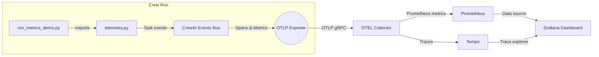

# Segment 3 · OpenTelemetry Metrics Bridge

This folder contains the runnable example for the Segment 3 lesson segment. It instruments CrewAI task events, exports spans/metrics over OTLP, and demonstrates how to watch latency + success metrics in Grafana/Prometheus.

## Architecture Overview



## Prerequisites

- Python dependencies from `LL5/requirements.txt` (already include the OpenTelemetry SDK + exporters).
- An OTLP collector accepting gRPC on `http://localhost:4317` (or set `OTLP_ENDPOINT`).
- CrewAI AMP authentication (optional but recommended so `tracing=True` still feeds AMP).
- LLM credentials (e.g., `OPENAI_API_KEY`) in your `.env`.

### Quick Local Collector

Use the provided compose file to spin up an OTEL collector, Tempo, Prometheus, and Grafana:

```bash
docker compose -f docker-compose.metrics.yml up --build
```

This launches:
- OpenTelemetry Collector (listens on `4317` for OTLP gRPC and forwards traces to Tempo + metrics to Prometheus).
- Tempo (single-binary, local filesystem storage, TraceQL search enabled) plus a tiny memcached sidecar for query caching.
- Prometheus (scrapes the collector’s metrics pipeline).
- Grafana (dashboards at <http://localhost:3000>; default creds `admin` / `admin`).

After `docker compose up`, give Tempo ~20 seconds to finish warming up (`curl http://localhost:3200/ready` returns `ready`). The memcached container is internal only; you don’t need to manage it directly.

## Environment Variables

Set these in `LL5/.env` or export in your shell:

```
OPENAI_API_KEY=sk-...            # required by CrewAI
OTLP_ENDPOINT=http://localhost:4317
OTEL_SERVICE_NAME=ll5-demo-crew
OTEL_ENVIRONMENT=lesson
CREWAI_TRACING_ENABLED=true      # optional, also streams to AMP
OTEL_EXPORT_INTERVAL_MS=1000     # shorter flush window keeps charts lively
DEMO_RUN_ITERATIONS=3            # how many times the crew runs per demo
DEMO_RUN_DELAY_SEC=2.0           # pause between runs to keep metrics flowing
DEMO_FLUSH_WAIT_SEC=3.0          # wait at the end for exporters to flush
```

Load them with `set -a && source ../.env && set +a` (after activating the `LL5/venv`) or call `python -m dotenv load`.

## Run the Demo

```bash
cd LL5/demos/segment3
python run_metrics_demo.py
```

You should see:
- The researcher/writer crew executing multiple back-to-back iterations (defaults to three).
- Histograms/counters exported to your OTLP collector (`crew_tasks_latency_ms`, `crew_tasks_success_total`, `crew_tasks_failure_total`) every second.
- Tempo traces for each task (`task::<task name>`) plus richer Grafana panels (latency p50/p90, throughput, failure counts, heatmap, trace list).

Open Grafana → “LL5 Observability” dashboard (see `grafana/dashboards/ll5-observability.json`) to visualize the metrics.

## Key Files

- `telemetry.py`: Initializes OTLP exporters and registers CrewAI event listeners to capture task start/completion/failure events.
- `run_metrics_demo.py`: Builds the same researcher/writer crew as Segment 2, but now runs multiple iterations with configurable pacing so Grafana panels have meaningful motion.
- `docker-compose.metrics.yml`: Local observability stack (collector + Prometheus + Grafana + Tempo).
- `grafana/dashboards/ll5-observability.json`: Sample dashboard definition; import into Grafana.

## Teaching Notes & Observability Pillars

- **Task Latency (p50/p90) + Heatmap**  
  Shows how long each agent task actually takes. Useful for spotting slow prompts, throttled APIs, or tool retries. This is the core of **Operational observability** on the lesson slide—real-time performance metrics you can tie back to reliability and cost.

- **Task Success / Failure Volume & Throughput**  
  Quick glance indicators that the crew is “breathing.” A sudden drop in throughput or spike in failures tells you something broke even before the run finishes. Also supports the **Operational** pillar.

- **Recent Task Spans (Tempo)**  
  Clicking into a span reveals the agent, task description, duration, and custom attributes. This gives a window into how agents progressed, nudging toward **Behavioral observability** (understanding reasoning flow). It’s not full thought tracing yet, but it shows the structure of each run.

- **Cumulative Task Outcomes**  
  Long-lived counts that help compare success/failure ratios across tasks. Combine with spans to explain “what happened” during a run.


## Troubleshooting

- *Nothing shows up in Grafana*: Verify `OTLP_ENDPOINT` and container status. If the crew finishes before exporters flush, increase `DEMO_FLUSH_WAIT_SEC` or leave the process running a few seconds after completion. Check collector logs (`docker compose ... logs otel-collector`) for rejected batches.
- *Collector refuses connection*: If using https, adjust `OTLP_ENDPOINT` and remove `insecure=True` from exporters in `telemetry.py`.
- *Crew run fails due to missing key*: Ensure `OPENAI_API_KEY` (or your chosen provider variables) is available in the environment.

## Cleanup

Stop the local observability stack with:

```bash
docker compose -f docker-compose.metrics.yml down
```

Traces + metrics stay in Tempo/Prometheus volumes (see compose file for mount points) if you need to persist them between runs.


