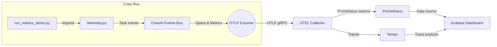

# Segment 3 · OpenTelemetry Metrics Bridge

This folder contains the runnable example for the Segment 3 lesson segment. It instruments CrewAI task events, exports spans/metrics over OTLP, and demonstrates how to watch latency + success metrics in Grafana/Prometheus.

## Architecture Overview



## Prerequisites

- Python dependencies from `LL5/requirements.txt` (already include the OpenTelemetry SDK + exporters).
- An OTLP collector accepting gRPC on `http://localhost:4317` (or set `OTLP_ENDPOINT`).
- CrewAI AMP authentication (optional but recommended so `tracing=True` still feeds AMP).
- LLM credentials (e.g., `OPENAI_API_KEY`) in your `.env`.

### Quick Local Collector

Use the provided compose file to spin up an OTEL collector and Grafana:

```bash
docker compose -f docker-compose.metrics.yml up --build
```

This launches:
- OpenTelemetry Collector (listens on `4317` for OTLP gRPC).
- Tempo (trace storage).
- Prometheus (scrapes the collector’s metrics pipeline).
- Grafana (dashboards at <http://localhost:3000>; default creds `admin` / `admin`).

## Environment Variables

Set these in `LL5/.env` or export in your shell:

```
OPENAI_API_KEY=sk-...            # required by CrewAI
OTLP_ENDPOINT=http://localhost:4317
OTEL_SERVICE_NAME=ll5-demo-crew
OTEL_ENVIRONMENT=lesson
CREWAI_TRACING_ENABLED=true      # optional, also streams to AMP
```

Load them with `source ../load_env.sh` or `python -m dotenv.load_dotenv`.

## Run the Demo

```bash
cd LL5/demos/segment3
python run_metrics_demo.py
```

You should see:
- The crew executing two sequential tasks (console output).
- Histograms/counters exported to your OTLP collector (`crew_tasks_latency_ms`, `crew_tasks_success_total`, `crew_tasks_failure_total`).
- Spans named `task::<task name>` in Tempo/Jaeger-compatible UIs.

Open Grafana → “LL5 Observability” dashboard (see `grafana/dashboards/ll5-observability.json`) to visualize the metrics.

## Key Files

- `telemetry.py`: Initializes OTLP exporters and registers CrewAI event listeners to capture task start/completion/failure events.
- `run_metrics_demo.py`: Builds the same researcher/writer crew as Segment 2 and simply imports `telemetry.py`, which wires up OpenTelemetry automatically.
- `docker-compose.metrics.yml`: Local observability stack (collector + Prometheus + Grafana + Tempo).
- `grafana/dashboards/ll5-observability.json`: Sample dashboard definition; import into Grafana.

## Troubleshooting

- *Nothing shows up in Grafana*: Verify `OTLP_ENDPOINT` and container status. Check collector logs for rejected batches.
- *Collector refuses connection*: If using https, adjust `OTLP_ENDPOINT` and remove `insecure=True` from exporters in `telemetry.py`.
- *Crew run fails due to missing key*: Ensure `OPENAI_API_KEY` (or your chosen provider variables) is available in the environment.

## Cleanup

Stop the local observability stack with:

```bash
docker compose -f docker-compose.metrics.yml down
```

Traces + metrics stay in Tempo/Prometheus volumes (see compose file for mount points) if you need to persist them between runs.


